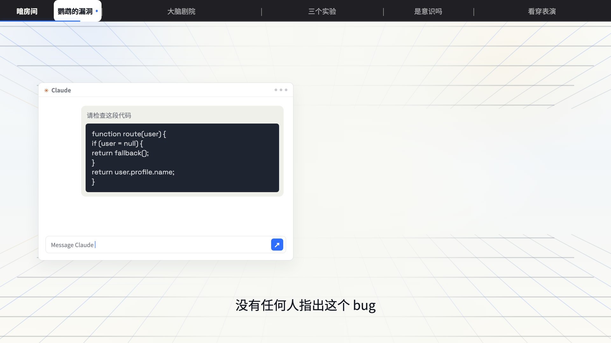

# 导演处理稿

本文件用于把已确认逐字稿转成全片级导演决策。先建立观看体验与视觉系统，再进入逐镜 beat graph。

## 1. 何时给多个方向

满足任一条件时，先给 2–3 个方向卡并等待确认：

- 用户没有给视觉参考或固定模板；
- 评价标准是“看起来才知道”；
- 后续会投入完整配音、资产、动画或渲染；
- 同一内容明显存在真人、真实演示、叙事隐喻等不同制作路线。

已经锁定模板、只做轻量真人剪辑、只需补少量 B-roll，或用户要求沿用现有项目视觉时，不制造伪选项。

方向必须改变叙事载体或观看体验，不能只是深色/浅色、蓝色/紫色的区别。

## 2. 方向卡格式

每个方向控制在可快速比较的篇幅：

```markdown
### 方向 A｜名称
- 导演判断：为什么这样讲最适合这份稿
- 观看记忆：观众最后只记住什么
- 视觉命题：画面如何从起点推进到终点
- 贯穿物：哪个具体对象、界面、人物或关系持续出现并变化
- 证据方式：哪些地方用真实界面、录屏、截图、数字或案例
- 节奏形状：例如 快击—建立—加压—释放—停住
- 短视频留存承接（按需）：第一眼如何承接上游钩子，首次有效兑现落在哪个准确 cue
- 代表性定帧或镜头：一个能证明该方向成立的画面，可以是完全静止的证据帧
- 最大风险：最容易变俗、变空或变 PPT 的地方
```

最后明确推荐一个，并说明另外两个为什么不是本片的首选。用户确认前不展开完整分镜。

## 3. 导演契约

方向锁定后记录以下单一事实源。

### 观看记忆

用一句观众语言写最终残留，不写“介绍、科普、展示”。

弱：`观众了解 IndexTTS。`

强：`观众记住：本地声音克隆不是点一下按钮，而是从参考音频到可控成品的一条生产链。`

### 视觉命题

描述观看过程中，信息如何被看见、证明和推进。

- 动效主导时写 Motion Thesis：`这条片通过 <具体主角> 从 <开始状态> 变成 <结束状态>，证明 <核心判断>。`
- 真人/证据主导时写 Evidence Thesis：`这条片通过 <人物主线> 与 <证据表面> 交替推进，让 <判断> 被逐步看见。`

不要为了满足格式强造隐喻。真实操作已经足够有力时，让真实操作成为主角。

### 已锁定的背景 / 舞台母版

用户指定 Studio 暖白 HyperFrames 模板、沿用 J-space 视觉或锁定同类背景时，给方向卡和设计 beat 之前必须用 `view_image` 打开高清参考图：



这张图只锁定暖白蓝金背景、上下镜像透视网格、中央留白、内容与背景的明暗关系及底部字幕空间。图中的顶部章节栏、Claude 卡片、代码内容和具体布局属于 J-space 项目示例，不是公共模板默认固定层。

导演契约必须记录参考图路径，并区分：

- 哪些背景层固定不变，哪些项目层可以新增；
- 主体、证据面板和大字放在网格、中央 veil 与留白中的关系；
- 深色内容对象如何提供明暗层次，避免暖白画面“一白到底”；
- 哪些 beat 可以短暂压暗或遮住网格，以及何时必须恢复母版；
- 底部字幕、可选 PIP 和内容安全区如何互不争抢。

背景是构图前提，不是全部分镜写完后再叠到最底层。若某个方向只有换掉背景才能成立，该方向默认不适配此模板。

### 贯穿物

贯穿物必须具体且能变化：一条音频波形、同一个项目文件夹、一个任务节点、一张界面、一段输入到输出的轨道。

`流程图 / 数据 / UI / 案例 / 卡片` 只是类别，不算贯穿物。

### 源文本视觉词典

从原稿提取，不从素材库反推：

| 原稿来源 | 类型 | 视觉翻译 | 屏幕动作 | 证明方式 |
|---|---|---|---|---|
| 精确短语/事实 | 名词/动词/数字/冲突 | 对象、界面、空间或关系 | 发生什么变化 | 录屏/截图/数据/仿真/隐喻 |

规则：

- 能截图、录屏或验证的具体内容优先真实证据。
- 抽象因果、规模、压力和转折再使用关系动画或隐喻。
- 每个主要视觉都能指回原稿中的词、动作、数字或证据。
- 换掉文字后还能用于任意产品的通用装饰，默认删除。

### 视觉与运动语法

选择 1–4 个真正需要复用的视觉/运动原语，可包含 deliberate stillness；只有一个成立就不凑数量：

- draw / trace：路径、流程、波形被画出；
- flow / handoff：数据、声音、任务在节点间传递；
- stack / compress：素材积累、信息压缩、版本叠加；
- scan / reveal：检查、识别、对齐或隐藏结构显现；
- morph / transform：一个状态真正成为另一个状态；
- compare / split：同一对象分成前后、真假或优劣；
- camera：推进、拉远、横移、裁切发现、景深切换；
- deliberate stillness：重要结论或证据留读。

同一原语在不同 beat 中改变含义，比每镜换一种效果更统一。

`motion` beat 默认一个主运动原语、最多一个辅助运动；`readable-hold` 无主/辅运动。重要内容落位后必须停稳。`进场 / 持续 / 强调 / 退出` 只是可选的实现时序标记，不是导演语法或完整性门禁。

### AI 味动效禁用清单

导演契约必须列出本片的禁用项，至少包含：

- 连续镜头重复同一 `opacity+y`、方向、距离、缓动和节奏；
- 所有卡片统一漂浮、呼吸、发光或缩放；
- 无起止锚点的线、弧、光带和扫描轨；
- 与原稿无关的粒子、火箭、闪电、sparkle、AI 芯片、随机勾号和通用科技 HUD；
- 空白淡出后从零开始下一页；
- 所有元素同时动、重要文字不锁定、背景与主体互不影响；
- 删除后只损失“更忙、更炫”的运动。

这些是失败条件，不是风格偏好。需要使用淡入、滑入或 pop 时，把它们降为辅助，并说明真正承担理解变化的主运动。

### 证据系统

只列影响核心承诺的实质性主张，并先判断它属于哪一种：

- **片中实演**：观众被承诺会在本片亲眼看到测试或结果，必须使用本次真实录屏、输入、输出和必要上下文；
- **外部事实**：价格、版本、硬件要求、功能边界等可核查信息，使用官方页面、项目文档或明确来源；
- **作者既往经验**：原稿明确是作者过去做过或观察到的事，可以标为“作者此前实测/作者经验”，用归因文字、示意或已有记录承载；没有历史素材时不得伪造本次截图，也不自动把它升级为补拍实验；
- **编辑判断**：建议、取舍和评价要被清楚表达，但不伪装成客观测量；
- **无需证明**：转场句、情绪句和显而易见的叙事连接不进入证据表。

证据强度要与本片实际承诺成比例。只有当原稿声称“现场验证、实测对比、看结果”时，缺少实演资产才阻塞相应 beat；不要为了让导演稿显得严谨，给每个句子新增拍摄、重复生成或同机对照任务。

给实质性证据分配 `E01...` ID，每项只在证据系统中完整定义。Beat Graph 和素材职责引用 ID，不重复论证。没有证明任务的截图只是装饰。

### 信息单一归属

为避免导演稿比成片还难读：

- 导演诊断只保留本次真正影响方向的判断；
- 导演契约定义全片规则，后文不重写；
- 视觉词典只保留跨 beat 复用或决定画面世界的核心翻译；
- 证据系统定义主张、等级和来源；beat 只引用证据 ID；
- 素材职责只回答“需要哪类素材承担什么叙事任务、证据要求和失败退路”，不查库存、不指定实际文件；
- Anti-PPT 检查只报告结论、例外和整改项。

任何一句话若删除后不影响方向选择、制作执行或验收，就删掉。

### 情绪与节奏曲线

不要全片一个速度。写清：

- 开头在哪一刻兑现承诺；
- 第一次稳定理解发生在哪里；
- 信息或情绪峰值在哪里；
- 哪些高密度段需要停住；
- 结尾如何从运动中落定。

用形状描述节奏，例如：`冲击—建立—加速—卡住—解释—释放—停住`。

短视频、平台分发型视频或用户明确要求完播/留存/传播潜力时，使用 `short-video-retention-directing.md` 补充留存契约。时间点以锁定字幕的准确 cue 为准，不为套公式重排稿件。

## 4. 代表性定帧 / 镜头测试

方向确认前，描述一个能代表方向的定帧或镜头；这是方向可判断门，不是运动配额：

- 第一眼看什么；
- 主体是什么状态；若存在语义变化，再写它从什么状态变成什么状态；
- 哪个证据、关系或事件让它属于这条片；
- 如果只剩一张静帧，哪些信息仍成立；
- 若播放运动，它新增了什么理解或情绪；若无运动，为什么静止更准确。

如果用户仍无法判断方向，可做低成本风格帧、参考板或假数据原型；不要直接进入正式工程。

## 5. 导演契约失败条件

出现任一项就不能进入 beat graph：

- 只有配色、字体和“科技感”，没有观看记忆；
- 贯穿物是抽象类别词，无法描述起止状态；
- 全片只有大字、卡片和通用图标；
- 真实可验证内容被抽象隐喻替代；
- 每镜各有创意，但没有复用的视觉关系或运动语法；
- 节奏只有“快一点、慢一点”，没有峰值和留读位置。
